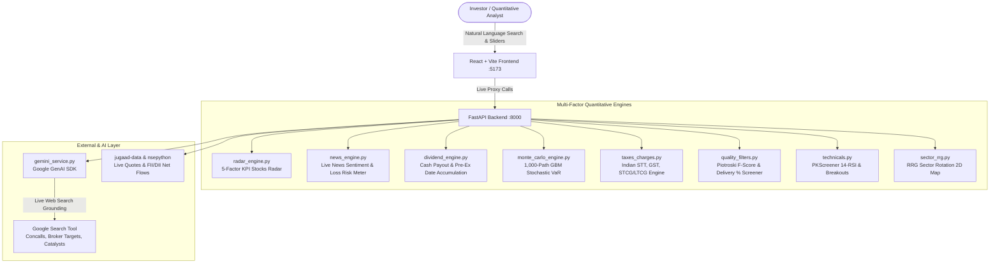

# 🚀 AlphaPulse India Pro
### Institutional-Grade Real-Time Equity, Dividend Intelligence & Post-Tax ROI Engine (NSE / BSE)

[](https://fastapi.tiangolo.com)
[](https://react.dev)
[](https://www.typescriptlang.org)
[](https://tailwindcss.com)
[](https://ai.google.dev)
[](https://www.incometax.gov.in)

---

## 🌟 Overview

**AlphaPulse India Pro** is an institutional-grade quantitative stock intelligence, risk analytics, and holding-period profit forecasting workstation designed for Indian equities (NSE / BSE). 

Built with a distraction-free, minimalist **Light Mode** design system, it combines live market feeds, 1,000-path stochastic Monte Carlo simulations, real-world Indian statutory tax deduction (Budget 2024 compliant), breaking news sentiment loss risk modeling, pre-dividend accumulation timing roadmaps, and **Google Gemini Live Web Search Grounding**.

---

## 💎 Core Institutional Modules



---

### 1. 📡 Real-Time KPI Stocks Radar ("Top Profitable Stocks to Buy Now")
- **5-Factor Institutional Multi-Factor Screener**:
  1. **Institutional Delivery %**: $\ge 50\%$ (accumulation confirmation vs. retail day-trading churn).
  2. **Piotroski F-Score**: $\ge 7/9$ (profitability, leverage, liquidity, and operating efficiency).
  3. **Technical Breakout / Golden Cross**: 20-day high breakout with volume surge ($>1.5\times$) or $50 > 200$ EMA golden cross via `PKScreener`.
  4. **Positive Live News Sentiment**: Aggregate news sentiment score $\ge +0.25$.
  5. **Post-Tax Annualized Projected ROI**: $\ge 15\%$.
- **Interactive Top Banner Deck**: Ranked top 6 high-conviction buys with live price, post-tax net gains (₹), target price, delivery %, and **1-Click Simulation Jump**.

---

### 2. 📰 Live News Feed & Loss Risk Probability Gauge
- **Live Financial News Ingestion**: Automatically pulls breaking financial headlines for the active stock with source links and timestamps.
- **Dynamic Trade Loss Risk Probability Meter**:
  - `sentiment_score`: Scale from $-1.0$ (Extreme Bearish) to $+1.0$ (Extreme Bullish).
  - `risk_of_loss_pct` & `win_probability_pct`: Quantifies the empirical probability of entering a losing trade.
  - `primary_catalyst`: Displays the exact corporate news event driving sentiment.
  - `sentiment_drift_modifier`: Dynamically modulates the Monte Carlo drift ($\mu$).

---

### 3. 💰 Dividend Intelligence & "When to Buy" Timing Roadmap
- **Capital Payout Calculator**: Input your capital (₹) and immediately see your exact annual cash payout and next interim credit:
  $$\text{Cash Payout} = \text{Shares} \times \text{DPS}$$
- **10-Day Pre-Dividend Optimal Accumulation Window**: Recommends the exact calendar dates to accumulate shares before the ex-dividend price adjustment rush.
- **4-Step Visual Progress Roadmap**:
  1. `Optimal Buy Window` $\to$ 2. `Ex-Dividend Cutoff Date` $\to$ 3. `Record Date (Demat)` $\to$ 4. `Direct Bank Account Credit`.
- **Top Indian Dividend Champions Ranked Deck**: Quick 1-click exploration of high-yield stocks (e.g., *COALINDIA, VEDL, RECLTD, PFC, ITC, TCS, BEL*).

---

### 4. 🎲 1,000-Path Stochastic Monte Carlo Simulation
- **Geometric Brownian Motion (GBM)**: Replaces naive straight lines with 1,000 random-walk stochastic paths:
  $$S_t = S_0 \exp\left(\left(\mu - \frac{\sigma^2}{2}\right)t + \sigma \sqrt{t} Z\right)$$
- **Statistical Percentiles**:
  - **Base Case (50th Percentile / Median)**: Most probable price trajectory with sector drift.
  - **Bull Case (90th Percentile)**: Statistical upside momentum ceiling.
  - **Bear Case (10th Percentile / VaR)**: 90% Value at Risk empirical floor modeling maximum expected drawdown.

---

### 5. 🇮🇳 Real In-Hand Post-Tax & Friction Engine (Budget 2024 Compliant)
Calculates exact real-world statutory levies and taxes so your net profit matches your bank account:
- **Securities Transaction Tax (STT)**: 0.1% on delivery exit turnover.
- **Exchange Turnover Fees**: ~0.00345% (NSE).
- **SEBI Turnover Charges**: ₹10 per crore (0.0001%).
- **Stamp Duty**: 0.015% on entry turnover.
- **GST**: 18% on (Brokerage + Exchange Fees + SEBI Charges).
- **Capital Gains Taxes**:
  - `Holding < 12 Months`: **STCG @ 20%** on net gains.
  - `Holding ≥ 12 Months`: **LTCG @ 12.5%** on net gains exceeding the ₹1,25,000 annual exemption limit.

---

### 6. 🌐 Google Gemini AI with Live Web Search Grounding
- **Search Tooling Integration**: Configured with `types.Tool(google_search=types.GoogleSearch())` via the `google-genai` Python SDK.
- **Consensus Research Targets**: Real-time aggregation of broker price targets from top research houses (*Motilal Oswal, ICICI Direct, Jefferies, Morgan Stanley*).
- **Quarterly Concall Takeaways**: Extracts management guidance, EBITDA margin trajectories, order backlog additions, and upcoming catalysts.

---

### 7. 🛡️ Institutional Quality & Governance Screener
- **NSE Delivery %**: Flags `>50%` as institutional accumulation vs `<25%` as speculative retail churn.
- **Piotroski F-Score (0 to 9)**: Evaluates profitability, leverage, liquidity, and operating efficiency.
- **Promoter Pledging**: Verifies promoter pledge integrity and flags any pledge `>15%` as a red flag.
- **Order Book Backlog (₹ Cr)**: Tracks sovereign and commercial order backlogs for defense, infra, and power titans.

---

### 8. 🔬 4 Genuine Open-Source Quantitative Integrations
- [`jugaad-py/jugaad-data`](https://github.com/jugaad-py/jugaad-data): Historical OHLCV candles, delivery percentages, and local caching.
- [`aeron7/nsepython`](https://github.com/aeron7/nsepython): Live NSE quotes, FII/DII net flows, and sector stats.
- [`pkjmesra/PKScreener`](https://github.com/pkjmesra/PKScreener): 14-period Wilder's RSI, 20-day breakout with volume surge (`>1.5x`), and 50/200 EMA golden cross.
- [`AdroitAnandAI/RRG-Sector-Rotation-India`](https://github.com/AdroitAnandAI/RRG-Sector-Rotation-India): 2D Relative Rotation Graph quadrant scatter plot (Leading, Improving, Weakening, Lagging).

---

## 📁 Repository Structure

```
alphapulse-india/
├── backend/
│   ├── app/
│   │   ├── api/
│   │   │   ├── routes_stocks.py       # Live quotes, search, candles, quality, news, KPI radar
│   │   │   ├── routes_simulator.py    # Monte Carlo & Post-Tax calculations
│   │   │   ├── routes_dividend.py     # Dividend analyzer & top yielders
│   │   │   └── routes_ai.py           # Gemini AI with Live Web Search Grounding
│   │   ├── quant/
│   │   │   ├── data_engine.py         # jugaad-data & nsepython adapters
│   │   │   ├── technicals.py          # PKScreener RSI, breakout & EMA cross
│   │   │   ├── sector_rrg.py          # Relative Strength 2D quadrant scatter
│   │   │   ├── quality_filters.py     # Piotroski F-Score & Promoter Pledge
│   │   │   ├── taxes_charges.py       # Indian STT, GST, STCG/LTCG tax engine
│   │   │   ├── monte_carlo_engine.py  # 1,000-path stochastic simulation & VaR
│   │   │   ├── news_engine.py         # Real-time news sentiment & loss risk meter
│   │   │   ├── dividend_engine.py     # Dividend cash payout & timing roadmap
│   │   │   └── radar_engine.py        # 5-factor real-time KPI stocks radar
│   │   ├── core/
│   │   │   ├── config.py              # Environment variables & constants
│   │   │   └── gemini_service.py      # Google GenAI with Search Grounding
│   │   └── main.py                    # FastAPI application entrypoint
│   ├── requirements.txt
│   └── .env.example
├── frontend/
│   ├── src/
│   │   ├── components/
│   │   │   ├── Navbar.tsx             # Top navbar with live status & FII/DII flow
│   │   │   ├── TickerTape.tsx         # Live continuous scrolling index ticker
│   │   │   ├── RealTimeRadarKPIs.tsx  # Top 6 profitable buys KPI deck
│   │   │   ├── AskAIBar.tsx           # Natural language query search with Web Grounding
│   │   │   ├── LiveNewsAndThesis.tsx  # Gemini web-grounded thesis & broker targets
│   │   │   ├── StockOverviewCard.tsx  # Live price, 1D-5Y chart, 52W range, Delivery %
│   │   │   ├── LiveNewsSentimentBar.tsx# Breaking headlines & loss risk gauge
│   │   │   ├── QualityScoreCard.tsx   # Piotroski F-Score (0-9) & Promoter Pledge
│   │   │   ├── TechnicalSignals.tsx   # PKScreener breakout, RSI & EMA cross
│   │   │   ├── SectorRrgMap.tsx       # 2D RRG Quadrant Scatter Map
│   │   │   ├── DividendAnalyzer.tsx   # Dividend cash calculator & timing roadmap
│   │   │   ├── ProfitSimulator.tsx    # Monte Carlo + Post-Tax Net In-Hand ROI
│   │   │   ├── ProjectionChart.tsx    # 1,000-path percentile confidence curves
│   │   │   ├── WatchlistVaultModal.tsx# Saved strategy vault & CSV export
│   │   │   └── SettingsModal.tsx      # Gemini API key configuration
│   │   ├── types/index.ts             # TypeScript data contracts
│   │   ├── services/api.ts            # Typed API client
│   │   ├── App.tsx                    # Master dashboard layout
│   │   └── index.css                  # Light-mode Tailwind styling
│   ├── package.json
│   └── vite.config.ts
├── run.sh                             # 1-click startup script
└── README.md
```

---

## ⚡ Quickstart

### Prerequisites
- Python 3.10+
- Node.js 18+

### 1-Click Startup
```bash
chmod +x run.sh
./run.sh
```

- **Frontend Workstation**: `http://localhost:5173`
- **Backend API**: `http://localhost:8000`
- **Interactive Swagger Docs**: `http://localhost:8000/docs`

---

## 🔒 Security & Privacy
- All API keys and environment variables are stored strictly locally in `.env` (safely blocked by `.gitignore`).
- No sensitive credentials, proprietary keys, or database binaries are pushed to GitHub.

---

### ⚖️ Disclaimer
*AlphaPulse India Pro is an educational and personal quantitative research simulator. It does not constitute SEBI-registered financial advisory. Past performance does not guarantee future results.*
