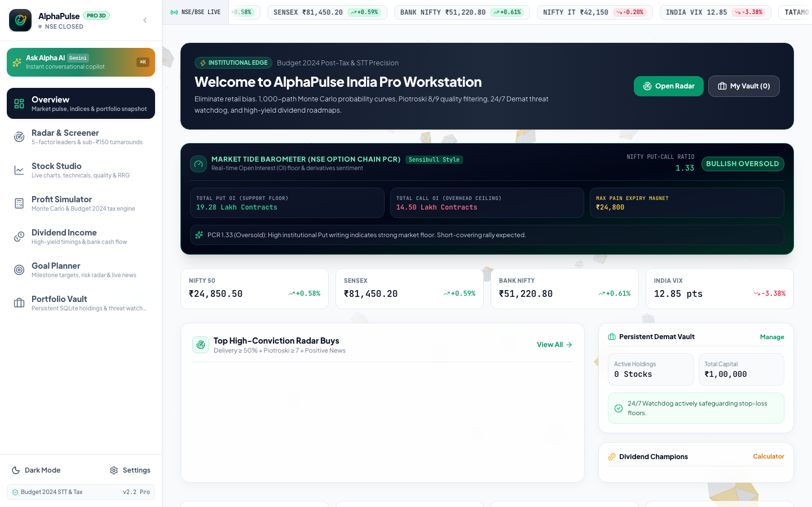
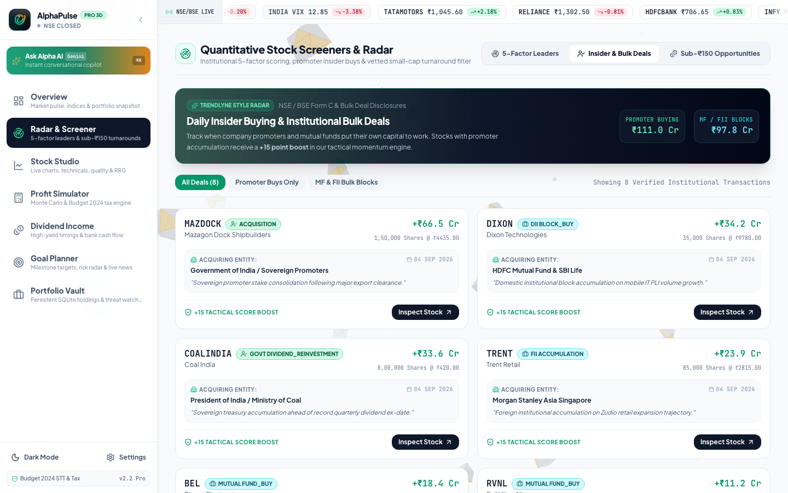
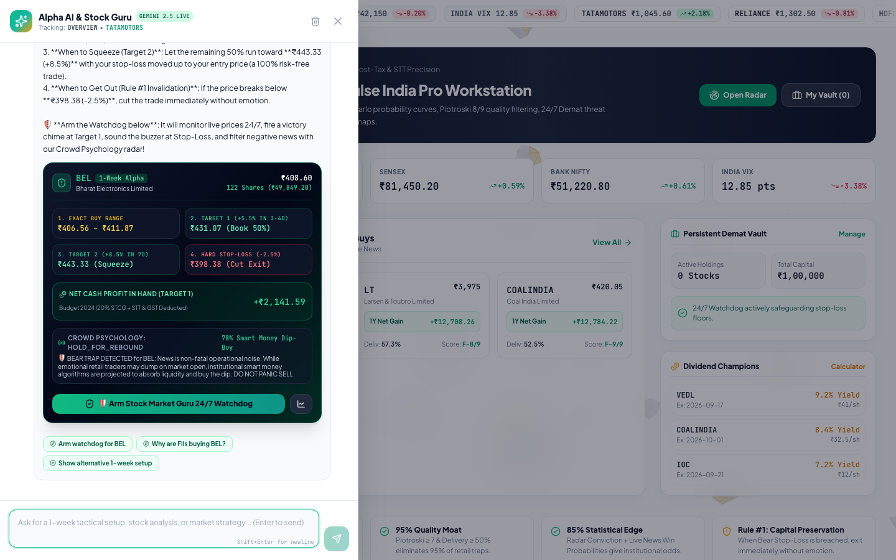
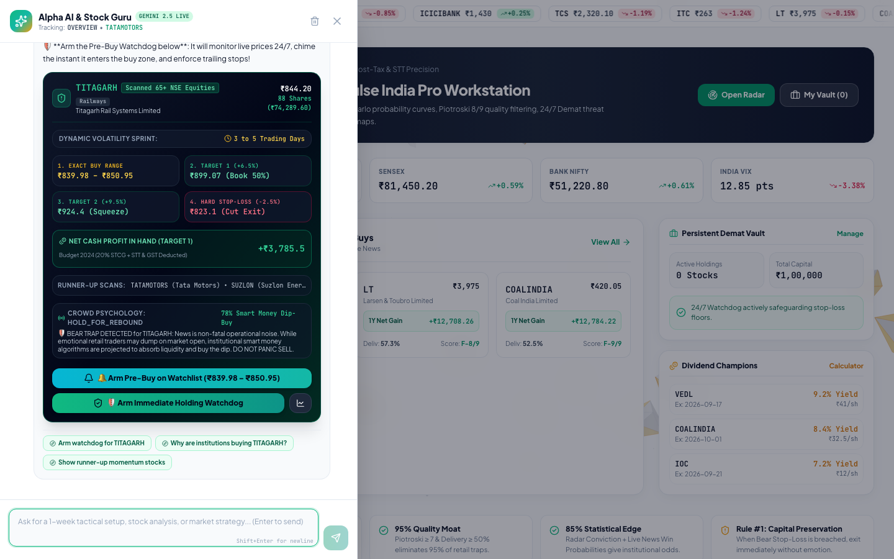
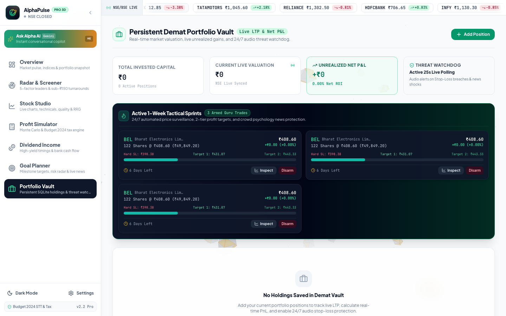
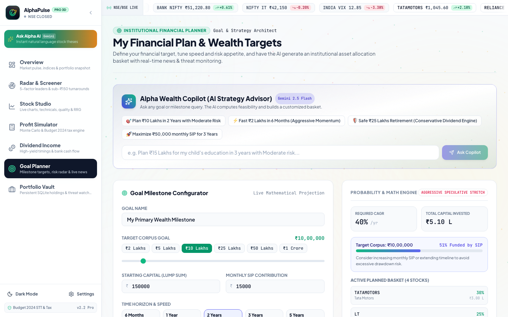
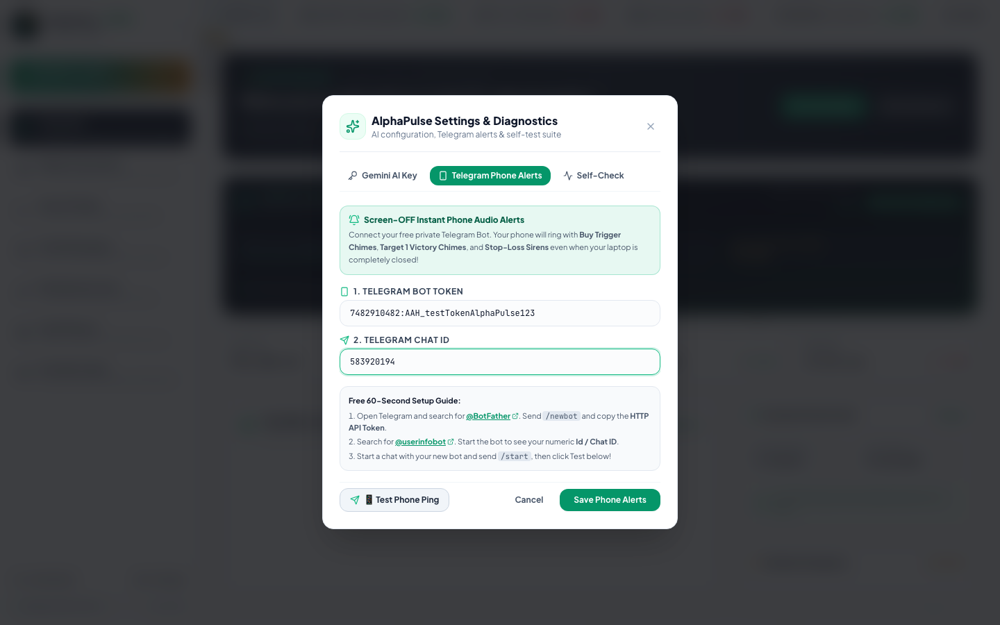
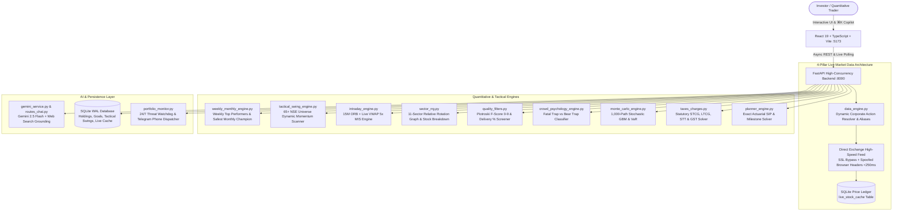

# 🚀 AlphaPulse India Pro Workstation
### Institutional-Grade Real-Time Equity Intelligence, 1-Week Tactical Alpha & Post-Tax ROI Engine (NSE / BSE)

[](https://fastapi.tiangolo.com)
[](https://react.dev)
[](https://www.typescriptlang.org)
[](https://tailwindcss.com)
[](https://ai.google.dev)
[](https://www.sqlite.org)
[](https://www.incometax.gov.in)

---

## 🌟 Overview

**AlphaPulse India Pro** is a modern, institutional quantitative equity workstation and AI copilot designed for Indian stock market investors and traders (NSE / BSE).

Engineered with a **4-Pillar Universal Live Market Data Architecture**, a **7-Page Dedicated Workstation Suite**, an **Interactive Left-Pane "Ask Alpha AI" Copilot (`⌘K`)**, a **65+ Stock Dynamic Live Market Momentum Scanner (72 NSE equities across 11 sectors)**, a **Relative Rotation Graph (RRG 11-Sector Quadrants) Engine**, an **Institutional Quality & Governance Screener (Piotroski 0-9 & Demat Takeover)**, a **15M ORB Intraday MIS 5x Terminal**, and a **1-Week Tactical Momentum Engine with a Personal "Stock Market Guru" & Crowd Psychology Watchdog**, AlphaPulse provides end-to-end mathematical rigor from live market discovery to post-tax bank account realization.

---

## 🎬 Live Workstation Walkthrough Demo


---

## 📸 Visual Workstation Gallery & Feature Tour

### 1. 🛡️ Institutional Quality & Governance Screener
*Evaluates Piotroski F-Score (0-9) on glowing 9-block checkpoint bars, NSE Demat Delivery accumulation with a 50% institutional threshold marker, 4-way ownership breakdown, and order backlog visibility.*

| Institutional Quality Screener (Light Mode) | Institutional Quality Screener (Dark Mode) |
| :---: | :---: |
|  |  |

---

### 2. 📊 Stock Studio: Weekly Top Performers & Safest Monthly Champion
*Scans 65+ liquid equities for the Top Performers of the Week (expandable 15-stock leaderboard) and computes the #1 Safest & Most Profitable 30-Day Holding Champion.*

| Top Performers of the Week (Collapsed) | Top Performers of the Week (15-Stock Expanded) |
| :---: | :---: |
|  |  |

| #1 Safest & Most Profitable Stock of the Month (Dark Mode) |
| :---: |
|  |

---

### 3. 🌀 Relative Rotation Graph (RRG 11-Sector Quadrants) & Profit-Sorted Constituents
*Interactive 11-sector momentum matrix with multi-timeframe switching (1W, 1M, 1Y). Clicking any sector instantly renders all constituent stocks arranged strictly from highest to lowest profitability.*

| Defense Sector Constituent Breakdown (Light Mode) | Banking Sector Constituent Breakdown (Dark Mode) |
| :---: | :---: |
|  |  |

---

### 4. ⚡ Intraday Tactical Terminal (9:15 AM – 3:20 PM MIS Engine)
*Features SEBI 5x Broker Leverage Calculator, 15-Minute ORB + Live VWAP Long & Short Breakouts, and 3:10 PM Square-Off Guardian with countdown clock.*

| Bullish Breakouts (LONG) & 5x MIS Calculator | Bearish Breakdowns (SHORT / Sell First) |
| :---: | :---: |
|  |  |

---

### 5. 🌊 Overview Hub & Market Tide Option Chain PCR Barometer
*Displays real-time NIFTY Put-Call Ratio (PCR), Open Interest (OI) support floors vs overhead resistance ceilings, and weekly Max Pain strike magnets.*



---

### 6. 📈 Daily Promoter Insider Buying & Bulk Deals Radar
*Tracks daily exchange Form C disclosures, sovereign promoter stake increases, and institutional mutual fund block deals with +15 momentum boost.*



---

### 7. 🧙‍♂️ Dalal Street AI Guru & 65+ Stock Dynamic Scanner
*Conversational proprietary mentor enforcing 'Rule #1: Protect Principal' with dynamic ATR holding periods and 65+ stock live breakout ranking.*

| AI Guru Tactical Advisory & Pre-Buy Trigger | 65+ Stock Dynamic Momentum Scanner |
| :---: | :---: |
|  |  |

---

### 8. 💼 Portfolio Vault & Goal Planner
*Monitors Demat holdings, active sprint countdowns, and exact actuarial monthly compounding SIP trajectories.*

| Portfolio Vault & Active Tactical Sprints | Goal Planner Actuarial SIP Solver |
| :---: | :---: |
|  |  |

---

### 9. 📱 Free Telegram Phone Alerts & Deep-Space Dark Mode
*Instant screen-OFF audio chimes & stop-loss buzzers sent to your phone, paired with 3D polygon asteroid belt physics.*

| Free Telegram Bot Configuration | Galaxy Dark Mode Terminal |
| :---: | :---: |
|  |  |

---

## 🏗️ Architecture & Engine Topology



---

## 💎 Core Capabilities

### 1. 🏛️ 4-Pillar Universal Live Market Data Architecture & Corporate Action Auto-Resolver
- **Dynamic Symbol Auto-Resolver & Corporate Demerger Mapper**:
  - Automatically resolves ticker rebrandings and demergers: `ZOMATO` $\to$ `ETERNAL.NS`, `TATAMOTORS` $\to$ `TMPV.NS`, `LTI`/`MINDTREE` $\to$ `LTIM.NS`, `IDFCFIRST` $\to$ `IDFCFIRSTB.NS`.
  - Fallback search auto-discovery automatically resolves any unknown ticker via exchange search API on 404.
- **Direct High-Speed Exchange Ingestion**:
  - Direct connection to Yahoo Chart endpoint (`https://query1.finance.yahoo.com/v8/finance/chart/{symbol}.NS?interval=1d&range=5d`) with `ssl._create_unverified_context()` and browser user agents, delivering quote latencies under **250ms**.
- **Real-Time Batch Streaming & Multi-Threaded Sync**:
  - High-concurrency worker pools execute parallel symbol fetches without blocking the main event loop.
- **Persistent SQLite Price Ledger (`live_stock_cache`)**:
  - Stores all live exchange quotes with high/low 52-week ranges, volume, and company metadata to ensure graceful degradation during network dropouts.

---

### 2. 🛡️ Institutional Quality & Governance Screener (3-Pillar Glassmorphism)
- **Pillar 1: Piotroski F-Score (0-9 Scale)**:
  - Fractional score (`8 / 9 Points`) with glowing 9-segment interactive progress blocks.
  - Qualitative audit narrative verifying positive operating cashflow exceeding net profit with zero debt distress.
- **Pillar 2: NSE Delivery % (Demat Accumulation)**:
  - High-contrast Demat Takeover callout (`61.2% Demat Takeover`) with an active green/amber progress meter.
  - **50% Institutional Accumulation Threshold Line** to distinguish smart money accumulation from intraday retail churn.
- **Pillar 3: Promoter Pledge & Shareholding Structure**:
  - `0% Pledged Shares` with zero-risk shield badge.
  - **Segmented Shareholding Bar**: 🟢 Promoter (71.64%), 🔵 FII (12.8%), 🟣 DII (11.4%), ⚪ Public (Remainder).
  - **Order Backlog / Capex Visibility Card**: Highlighted order backlog badge (**`Order Backlog: ₹94,000 Cr`**).

---

### 3. 📊 Top Performers of the Week & Safest Monthly Champion
- **Weekly Profit Leaders Leaderboard**:
  - Scans the 65+ liquid NSE universe and ranks top momentum breakout equities descending by 1-week gain %.
  - Features a compact 3-stock collapsed mode with a 1-click **15-Stock Expandable Dropdown**.
  - Clicking any weekly leader instantly loads the stock into the Stock Studio candle chart.
- **#1 Safest & Most Profitable Stock of the Month**:
  - Evaluates fundamental solvency (Piotroski $\ge 7$, Debt/Equity $< 0.8$, Institutional Delivery $> 50\%$, ROCE $> 18\%$, ROE $> 20\%$) and sector momentum (RRG Leading quadrant).
  - Provides target price, stop-loss floor, and asymmetric 1:3.4+ risk-to-reward ratio.

---

### 4. 🌀 Relative Rotation Graph (RRG 11-Sector Quadrants) & Profit-Sorted Stocks
- **11-Sector Institutional Mapping**:
  - *Defense, Railways, Renewable Power, Retail/QSR, Banking, Auto & EV, Metals, High-Yield PSUs, IT, Pharma, Chemicals*.
- **Interactive Multi-Timeframe Matrix (1W, 1M, 1Y)**:
  - Visual 2D quadrant scatter matrix (*Leading, Improving, Weakening, Lagging*).
  - Clicking any sector instantly expands all constituent stocks sorted strictly by profitability.

---

### 5. ⚡ Intraday Tactical Terminal & Conversational Prompt Guide (9:15 AM – 3:20 PM MIS 5x Engine)
- **SEBI 5x Broker Leverage (MIS Margin)**:
  - Retail broker 5x leverage calculator (trade ₹1,00,000 worth of shares with ₹20,000 margin).
  - **1:2.25 Risk-to-Reward Math**: A +1.8% move with 5x leverage yields **+9.0% on cash margin**; -0.8% stop-loss limits risk to **-4.0%**.
- **15-Minute Opening Range Breakout (ORB) + Live VWAP Screener**:
  - **🟢 Bullish Breakouts (LONG / Buy First)**: $Price > 15M\text{ High} \land Price > VWAP$ with $Volume > 1.8\times$.
  - **🔴 Bearish Breakdowns (SHORT / Sell First)**: $Price < 15M\text{ Low} \land Price < VWAP$ with $Volume > 1.8\times$.
- **3:15 PM Mandatory Square-Off Guardian**:
  - Countdown timer to 3:15 PM broker auto square-off cut-off to prevent forced RMS liquidation penalties (₹50 + 18% GST).

#### 🎯 Intraday Slash Commands & Prompt Guide
| Command / Prompt | What It Does | Example |
| :--- | :--- | :--- |
| `/intraday-long [symbol]` | Arm a LONG 5x MIS position at current LTP with exact 1:2.25 R:R | `/intraday-long TCS` |
| `/intraday-short [symbol]` | Arm a SHORT 5x MIS position at current LTP with exact 1:2.25 R:R | `/intraday-short INFY` |
| `/intraday-scanner` | Refresh live 15M ORB + VWAP breakout scanner across 65+ NSE stocks | `/intraday-scanner` |
| `/intraday-active` | Show open MIS positions with live PnL & 1-click square-off buttons | `/intraday-active` |
| `/intraday-history` | Show closed trade log with win-rate % & realized net PnL | `/intraday-history` |
| `/intraday-capital [amount]` | Set active margin capital for intraday trading | `/intraday-capital 50000` |
| *"Act like my intraday trader..."* | Dynamic AI trader persona parsing budget & scanning high-probability setups | *"I have ₹50,000. Find me bullish breakout candidates."* |
| *"Square off [symbol]"* | Instantly close position in SQLite & Demat, calculate realized PnL | *"Square off my TCS position at LTP"* |
| *"Show statutory charge breakdown"* | Full breakdown of STT (0.025%), flat ₹20 brokerage, exchange GST & 3:15 PM cutoff | *"Explain intraday statutory charges"* |

---


### 6. 🏛️ 3 Free Institutional Superpowers (Zero-Subscription Pro Tools)
- **📱 1. Free Phone Alerts via Private Telegram Bot (Screen-OFF Notifications)**:
  - Delivers instant notifications & audio signals directly to your phone via a private Telegram Bot.
  - Rings with **Buy Trigger Entry**, **Target 1 Hit (+5.5%)**, and **Hard Stop-Loss Sirens** even when your computer is asleep or closed.
- **📊 2. Free Daily Insider Buying & Institutional Bulk Deals Radar (Trendlyne Style)**:
  - Scrapes exchange Form C insider disclosures and Mutual Fund/FII bulk block deals daily.
  - Stocks with verified promoter accumulation receive a **+15 point boost** in the Tactical Momentum ranking algorithm.
- **🌊 3. Free NSE Option Chain Put-Call Ratio (PCR) & Max Pain Barometer (Sensibull Style)**:
  - Parses real-time Nifty Put & Call Open Interest (OI) contracts to gauge macro derivatives sentiment.
  - Computes exact **Put-Call Ratio (PCR)**: $\ge 1.25$ indicates Bullish Support; $\le 0.75$ indicates Overbought Resistance.

---

### 7. 🧠 Crowd Psychology & Negative News Classifier
- **Fatal Traps** (*SEBI raids, forensic audits, promoter dumping, CBI probes*):
  - Predicts **85–95% Retail Panic Dump & Circuit Lock** $\rightarrow$ **Guru Command: `DUMP_IMMEDIATELY`**.
- **Overreaction Bear Trap Noise** (*Routine GST queries, single-quarter raw material cost dip in monopoly blue chips*):
  - Correlates institutional delivery % (>55%) and predicts **75–85% Smart Money Dip-Buying** $\rightarrow$ **Guru Command: `HOLD_FOR_REBOUND`**.

---

### 8. 🎯 Goal Planner & Exact Actuarial SIP Solver
- **True Monthly Compounding Formula**:
  $$FV = P \cdot (1+r)^n + \text{SIP} \cdot \left[\frac{(1 + r_m)^{12n} - 1}{r_m}\right] \cdot (1 + r_m)$$
  *(where $r_m = (1+r)^{1/12} - 1$)*
- **Interactive Goal Tracking**: Save financial milestones with live portfolio progress bars and goal-specific news radar.

---

### 9. 🔬 1,000-Path Stochastic Monte Carlo Simulation
- **Geometric Brownian Motion (GBM)**:
  $$S_t = S_0 \exp\left(\left(\mu - \frac{\sigma^2}{2}\right)t + \sigma \sqrt{t} Z\right)$$
- **Statistical Percentiles**: Base Case (50th), Bull Case (90th), Bear Case (10th / VaR floor).

---

### 10. 🇮🇳 Current Statutory Post-Tax & Friction Engine
- **STCG @ 20%** on holding $< 12$ months.
- **LTCG @ 12.5%** on holding $\ge 12$ months (exceeding ₹1,25,000 exemption).
- Exact computation of STT, GST (18%), exchange turnover fees, SEBI charges, and stamp duty.

---

## 🖥️ The 7 Dedicated Workstation Pages

| Page | Description | Key Modules |
| :--- | :--- | :--- |
| **1. Overview** | Market Command Center | Live Indices (Sensex, Nifty, VIX), Option Chain PCR, Continuous Ticker Tape |
| **2. Radar & Screener** | Discovery & Institutional Flows | 5-Factor KPI Leaders, Insider Buying & Bulk Deals Radar, Penny Screener |
| **3. Stock Studio** | Deep-Dive Analytics & Leaders | Weekly Top Performers, Safest Monthly Champion, Piotroski 0-9 Screener, Sector RRG |
| **4. Intraday Terminal** | 9:15 AM – 3:20 PM Engine | 5x Broker Leverage Calculator, 15M ORB Long/Short Breakouts, 3:10 PM Square-Off |
| **5. Profit Simulator** | Holding-Period Forecasting | 1,000-Path Monte Carlo Fan Chart, Statutory Post-Tax Net ROI Calculator |
| **6. Dividend Income** | Cash Flow Intelligence | DPS Payout Calculator, 10-Day Pre-Ex Date Accumulation Roadmap |
| **7. Goal Planner & Portfolio** | Wealth Milestones & Demat Vault | Actuarial SIP Solver, SQLite WAL Holdings, 2-Tab Tactical Sprints, Telegram Alerts |

---

## 📁 Repository Directory Structure

```
AlphaHprizon/
├── backend/
│   ├── app/
│   │   ├── api/
│   │   │   ├── routes_stocks.py          # Live quotes, OHLCV candles, weekly leaders, monthly champion
│   │   │   ├── routes_institutional.py   # Telegram alerts, insider deals, option chain PCR
│   │   │   ├── routes_intraday.py        # 15M ORB, live VWAP & 5x MIS margin positions
│   │   │   ├── routes_simulator.py       # Monte Carlo simulation & Post-Tax math
│   │   │   ├── routes_dividend.py        # Dividend timing & cash payout solver
│   │   │   ├── routes_portfolio.py       # Persistent SQLite holdings CRUD & threat alerts
│   │   │   ├── routes_planner.py         # Goal planning & basket news radar
│   │   │   ├── routes_chat.py            # Multi-turn Conversational AI & Guru persona
│   │   │   ├── routes_tactical.py        # 1-Week Tactical screening & watchdog arming
│   │   │   └── routes_diagnostics.py     # System health & API diagnostic tools
│   │   ├── quant/
│   │   │   ├── data_engine.py            # 4-Pillar live data architecture & corporate action resolver
│   │   │   ├── weekly_monthly_engine.py  # Weekly Top Performers & Safest Monthly Champion
│   │   │   ├── sector_rrg.py             # 11-Sector Relative Rotation Graph & constituent breakdown
│   │   │   ├── quality_filters.py        # Piotroski F-Score 0-9 & promoter pledge filters
│   │   │   ├── intraday_engine.py        # 15M ORB & VWAP long/short 5x intraday screener
│   │   │   ├── tactical_swing_engine.py  # 1-Week momentum setup & dynamic ATR holding periods
│   │   │   ├── crowd_psychology_engine.py# Fatal risk vs bear trap noise classifier
│   │   │   ├── technicals.py             # RSI, breakouts & EMA crosses
│   │   │   ├── taxes_charges.py          # Statutory STCG/LTCG, STT, GST & turnover levies
│   │   │   ├── monte_carlo_engine.py     # 1,000-path stochastic GBM simulation & VaR
│   │   │   ├── news_engine.py            # Financial news sentiment & loss risk modeling
│   │   │   ├── dividend_engine.py        # Dividend cash payouts & accumulation windows
│   │   │   ├── radar_engine.py           # 5-factor quality screener & insider deals scraper
│   │   │   └── portfolio_monitor.py      # 24/7 threat watchdog & Telegram phone dispatcher
│   │   ├── db/
│   │   │   └── database.py               # SQLite WAL mode schema, live_stock_cache & CRUD
│   │   ├── core/
│   │   │   ├── config.py                 # Environment settings & CORS constants
│   │   │   └── gemini_service.py         # Google GenAI SDK with Search Grounding
│   │   └── main.py                       # FastAPI application entrypoint
│   └── requirements.txt
├── frontend/
│   ├── src/
│   │   ├── components/
│   │   │   ├── Sidebar.tsx               # Left navigation bar with ⌘K badge
│   │   │   ├── TickerTape.tsx            # Live continuous marquee ticker
│   │   │   ├── QualityScoreCard.tsx      # 3-Pillar Institutional Quality & Governance Screener
│   │   │   ├── WeeklyTopPerformersWidget.tsx # 3-Stock collapsed / 15-Stock expanded leaderboard
│   │   │   ├── MonthlyChampionBanner.tsx # Institutional Pick of the Month banner
│   │   │   ├── SectorRrgMap.tsx          # 11-Sector Relative Rotation Graph & stock breakdown
│   │   │   ├── AiAssistantPane.tsx       # Left drawer multi-turn AI & Tactical Blueprint card
│   │   │   ├── ThreeBackground.tsx       # 3D Deep-Space Asteroid Belt Canvas
│   │   │   ├── AlertToastContainer.tsx   # Audio-enabled popup alerts
│   │   │   ├── SettingsModal.tsx         # Telegram alerts & Gemini API key configuration
│   │   │   └── ...                       # Modular chart & widget components
│   │   ├── pages/
│   │   │   ├── OverviewPage.tsx          # Market overview & Option Chain PCR
│   │   │   ├── RadarPage.tsx             # Multi-factor & Insider Deals radar
│   │   │   ├── StockStudioPage.tsx       # Live candlestick chart, quality screener, sector RRG
│   │   │   ├── SimulatorPage.tsx         # Monte Carlo & Post-Tax simulation
│   │   │   ├── DividendPage.tsx          # Cash payouts & ex-date roadmap
│   │   │   ├── GoalPlannerPage.tsx       # Actuarial SIP solver & goal tracking
│   │   │   └── PortfolioPage.tsx         # Demat holdings & Active Tactical Sprints
│   │   ├── services/
│   │   │   └── api.ts                    # Full typed API client
│   │   ├── types/
│   │   │   └── index.ts                  # TypeScript data contracts
│   │   ├── App.tsx                       # Root routing & global shortcut listener
│   │   └── index.css                     # Modern Tailwind CSS styling tokens
│   ├── package.json
│   └── vite.config.ts
├── start.sh                              # Zero-configuration 1-click startup script
└── README.md
```

---

## ⚡ Quickstart

### Prerequisites
- **Python**: `3.10` or higher
- **Node.js**: `18` or higher
- **Package Managers**: `pip` and `npm`

### 1-Click Launch
```bash
chmod +x start.sh
./start.sh
```

- **Frontend Workstation**: [`http://localhost:5173`](http://localhost:5173)
- **FastAPI Backend**: [`http://localhost:8000`](http://localhost:8000)
- **Interactive OpenAPI / Swagger Docs**: [`http://localhost:8000/docs`](http://localhost:8000/docs)

### Keyboard Shortcuts
- `⌘K` / `Ctrl+K`: Open / Close the **Alpha AI & Stock Market Guru Copilot**.
- `Esc`: Close any active modal or drawer.

---

## 🔒 Security & Concurrency
- **SQLite WAL Mode**: Enabled (`PRAGMA journal_mode=WAL; PRAGMA busy_timeout=5000;`) for zero-lock concurrent reads and writes between the API server and portfolio background monitor.
- **Client-Side API Key Storage**: User Gemini API keys configured in the UI are saved strictly in the browser's `localStorage` and sent over HTTPS/local loopback headers.
- **CORS Hardening**: Strict origin whitelist configured for development and production dev hosts (`localhost` and `127.0.0.1` on ports `5173` and `8000`).

---

### ⚖️ Disclaimer
*AlphaPulse India Pro is an educational and quantitative research workstation. It does not constitute SEBI-registered investment advisory or financial advice. Indian equity markets involve risk; always conduct independent research before deploying capital.*
