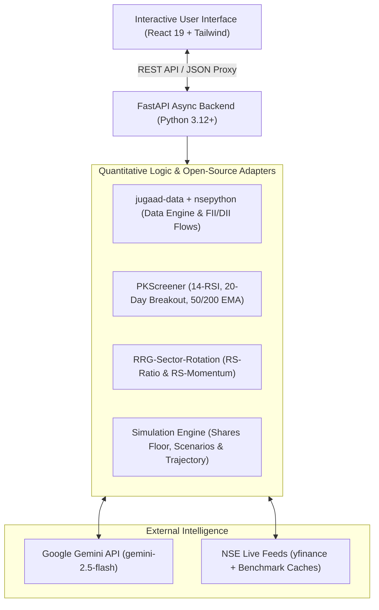

<div align="center">

# ⚡ AlphaPulse India
### *Institutional-Grade Quantitative Equity Intelligence & Holding-Period ROI Simulator for NSE/BSE*

[](https://fastapi.tiangolo.com)
[](https://react.dev/)
[](https://www.typescriptlang.org/)
[](https://vitejs.dev/)
[](https://tailwindcss.com/)
[](https://aistudio.google.com/)

<p align="center">
  <b>AlphaPulse India</b> is a lightweight, private quantitative trading and equity intelligence workspace built specifically for Indian Equities (NSE/BSE). It fuses natural language queries with <b>Google Gemini AI</b>, institutional quantitative algorithms (<b>jugaad-data</b>, <b>nsepython</b>, <b>PKScreener</b>, and <b>RRG Sector Rotation</b>), and a real-time <b>Capital & Holding-Period Profit Simulator</b>.
</p>

[Quick Start](#-quick-start) • [Features](#-core-features) • [Quant Architecture](#-quantitative-engines--adapters) • [Math & Formulations](#-quantitative-formulations) • [API Docs](#-api-endpoints)

---

</div>

## 🌟 Core Features

### 1. 🤖 "Ask AI" Natural Language Stock Explorer
- Query stocks and sectoral themes using plain English:
  - *"Suggest 3 high-growth infrastructure or power stocks for ₹1,00,000 over 2 years"*
  - *"Analyze Tata Motors EV transition for ₹50,000 over 6 months"*
  - *"Find low-risk bluechip dividend compounders with >35% ROCE"*
- Grounded in Indian financial ratios: **ROCE, ROE, P/E vs. Sector P/E, Order Book Backlog, Capex Runway, and Debt-to-Equity**.
- Structured AI outputs: Thesis breakdown, Key Catalysts (🌱), Risk Watch Items (⚠️), Holding Verdicts (*Strong Accumulate*, *Tactical Buy*, *Hold*), and Target Upside Bands.
- One-click **"Simulate in Engine"** button to project capital growth.

---

### 2. 📊 Real-Time Market Overview & Stock Studio
- **Live NSE Quotes**: LTP, Day Change (₹ and %), 52-Week Range indicator bar, Market Cap (₹ Cr), ROCE, ROE, P/E vs. Sector P/E, Debt-to-Equity, and Beta.
- **PKScreener Technical Signals**:
  - **14-day Wilder's RSI** with Overbought / Neutral / Oversold condition analysis.
  - **20-day High Price Breakout** detector with volume confirmation (`>1.5x` 20-day SMA volume).
  - **50-day / 200-day EMA Trend Alignment** (Golden Cross / Bullish trend).
  - Composite Quantitative Score (`0–100`).
- **RRG Sector Quadrant Matrix**:
  - Evaluates Relative Strength Ratio and Momentum against the **NIFTY 50** benchmark.
  - Quadrant tags: `Leading` (Emerald), `Improving` (Indigo), `Weakening` (Amber), and `Lagging` (Rose).
- **Institutional Net Flows**: Real-time FII & DII daily flow summary and NIFTY 50 level.

---

### 3. 💰 Capital & Holding Period Profit Simulator *(CORE ENGINE)*
- **Interactive Inputs**:
  - **Capital Input (₹)**: Stepper + Presets (`₹10,000`, `₹25,000`, `₹50,000`, `₹1,00,000`, `₹5,00,000`).
  - **Holding Duration**: Segmented buttons for `1M`, `3M`, `6M`, `1Y`, `2Y`, `3Y`, `5Y`.
  - **Risk Appetite**: `Conservative`, `Moderate`, `Aggressive`.
- **Dynamic Real-Time Calculation HUD**:
  - Exact Share Count: $\text{Shares} = \lfloor \frac{\text{Capital}}{\text{Price}} \rfloor$
  - Deployed Capital & Uninvested Cash Reserve Buffer.
  - **3 Scenario Forecast Cards**:
    - **⚖️ Base Target (50% Prob)**: Consensus CAGR price target, projected % gain, and absolute profit in ₹.
    - **🚀 Bull Target (25% Prob)**: Multi-year order book acceleration target, projected % gain, and potential gain in ₹.
    - **🛡️ Bear Target / Stop Loss (25% Prob)**: Beta-adjusted trailing stop-loss price and maximum drawdown in ₹.
  - **Expected Value**: Probability-weighted return and Risk-to-Reward ratio ($1 : \text{RR}$).
- **Interactive Compound Curve Chart**: Month-by-month capital expansion trajectory from Month 0 to Month $N$.

---

## 🏗️ Quantitative Engines & Adapters



| Component | Open-Source Source | Functionality |
| :--- | :--- | :--- |
| **Data Engine** | [`jugaad-py/jugaad-data`](https://github.com/jugaad-py/jugaad-data) + [`nsepython`](https://github.com/aeron7/nsepython) | Live quotes, daily OHLCV candles, and institutional FII/DII net flows. |
| **Technical Signals** | [`pkjmesra/PKScreener`](https://github.com/pkjmesra/PKScreener) | 14-day Wilder's RSI, 20-day breakout with >1.5x volume surge, and 50/200 EMA crosses. |
| **Sector Rotation** | [`AdroitAnandAI/RRG-Sector-Rotation-India`](https://github.com/AdroitAnandAI/RRG-Sector-Rotation-India) | RS-Ratio & RS-Momentum quadrant classification against NIFTY 50. |
| **AI Thesis Engine** | [`google-genai` SDK](https://github.com/google-gemini/generative-ai-python) | Structured thesis generation evaluating ROCE, order books, and capex. |

---

## 📐 Quantitative Formulations

### 1. Share Quantity & Capital Allocation
$$\text{Shares} = \left\lfloor \frac{\text{Capital}}{\text{Price}_{\text{current}}} \right\rfloor$$
$$\text{Deployed Capital} = \text{Shares} \times \text{Price}_{\text{current}}$$
$$\text{Cash Buffer} = \text{Capital} - \text{Deployed Capital}$$

### 2. Probability-Weighted Expected Value
$$\mathbb{E}[\text{Profit}] = (\text{Profit}_{\text{Bull}} \times 0.25) + (\text{Profit}_{\text{Base}} \times 0.50) + (\text{Profit}_{\text{Bear}} \times 0.25)$$
$$\text{Risk-to-Reward Ratio} = \frac{\text{Profit}_{\text{Bull}}}{|\text{Profit}_{\text{Bear}}|}$$

### 3. Wilder's Relative Strength Index (14-Day RSI)
$$\text{RS} = \frac{\text{Smoothed Avg Gain}_{14}}{\text{Smoothed Avg Loss}_{14}}, \quad \text{RSI} = 100 - \left( \frac{100}{1 + \text{RS}} \right)$$

### 4. Relative Rotation Graph (RRG) Quadrants
- **Leading**: $\text{RS-Ratio} \ge 100 \land \text{RS-Momentum} \ge 100$ *(Strong relative outperformance)*
- **Improving**: $\text{RS-Ratio} < 100 \land \text{RS-Momentum} \ge 100$ *(Bottoming out with rising momentum)*
- **Weakening**: $\text{RS-Ratio} \ge 100 \land \text{RS-Momentum} < 100$ *(Outperforming but losing momentum)*
- **Lagging**: $\text{RS-Ratio} < 100 \land \text{RS-Momentum} < 100$ *(Underperforming benchmark)*

---

## ⚡ Quick Start

### Prerequisites
- **Python 3.10+** installed on your Mac/Linux/Windows system.
- **Node.js 18+** and `npm`.

### 1-Click Launch Script
Clone the repository and run:

```bash
git clone https://github.com/deadheaven07/AlphaHprizon.git
cd AlphaHprizon
chmod +x run.sh
./run.sh
```

The script automatically sets up the Python virtual environment, installs backend dependencies, installs frontend packages, and launches both servers concurrently:
- 🌐 **Web Dashboard**: [http://localhost:5173](http://localhost:5173)
- 📖 **FastAPI Swagger Docs**: [http://localhost:8000/docs](http://localhost:8000/docs)

---

### Manual Launch (Alternative)

#### Terminal 1 — Backend (FastAPI):
```bash
python3 -m venv backend/venv
source backend/venv/bin/activate
pip install -r backend/requirements.txt
PYTHONPATH=. uvicorn backend.app.main:app --host 127.0.0.1 --port 8000 --reload
```

#### Terminal 2 — Frontend (Vite + React):
```bash
cd frontend
npm install
npm run dev
```

---

## 🔑 Environment Configuration

Create a `.env` file in the root directory (or use the built-in UI settings modal):

```env
# Optional: Google Gemini API Key (get a free key at https://aistudio.google.com/)
GEMINI_API_KEY=your_gemini_api_key_here

# Model Selection
GEMINI_MODEL=gemini-2.5-flash

# Server Configuration
PORT=8000
HOST=0.0.0.0
```

> [!NOTE]
> If `GEMINI_API_KEY` is not set, AlphaPulse India seamlessly falls back to its built-in quantitative heuristic engine so the dashboard is immediately 100% operational without errors.

---

## 📡 API Endpoints

| Method | Endpoint | Description |
| :--- | :--- | :--- |
| `GET` | `/api/health` | Health status and configured engine sources. |
| `GET` | `/api/stocks/market-status` | FII/DII institutional net flows and NIFTY 50 sentiment. |
| `GET` | `/api/stocks/quote?symbol={SYM}` | Real-time quote, valuation ratios, technicals, and RRG quadrant. |
| `GET` | `/api/stocks/search?q={QUERY}` | Autocomplete search across Indian equities. |
| `GET` | `/api/stocks/candles?symbol={SYM}` | Historical OHLCV candle series for charting. |
| `GET` | `/api/stocks/technicals?symbol={SYM}` | PKScreener 14-RSI, 20-day breakout, and 50/200 EMA status. |
| `POST` | `/api/simulator/calculate` | Real-time capital & holding period scenario profit projections. |
| `POST` | `/api/ai/analyze` | Gemini AI structured equity thesis, catalysts, and risk factors. |

---

## 🎨 Design System & Aesthetics
- **Theme**: Crisp Minimalist Light Palette (`#FFFFFF` pure white, `#F8FAFC` canvas).
- **Primary Accent**: Soft Indigo (`#4F46E5` / `#6366F1`).
- **Profit Accent**: Mint Emerald Green (`#10B981` text, `#ECFDF5` badges).
- **Risk / Stop Loss Accent**: Rose Coral (`#F43F5E` text, `#FFF1F2` badges).
- **Typography**: Plus Jakarta Sans & Inter with JetBrains Mono for monetary figures.

---

<div align="center">

Built for private, personal quantitative research on Indian Equities (NSE/BSE).

</div>
