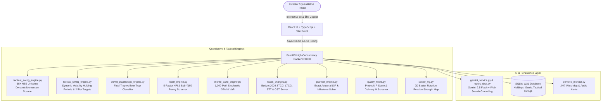

# 🚀 AlphaPulse India Pro Workstation
### Institutional-Grade Real-Time Equity Intelligence, 1-Week Tactical Alpha & Post-Tax ROI Engine (NSE / BSE)

[](https://fastapi.tiangolo.com)
[](https://react.dev)
[](https://www.typescriptlang.org)
[](https://tailwindcss.com)
[](https://ai.google.dev)
[](https://www.sqlite.org)
[](https://www.incometax.gov.in)

---

## 🌟 Overview

**AlphaPulse India Pro** is a modern, modular institutional quantitative equity workstation and AI copilot designed for Indian stock market investors (NSE / BSE). 

Engineered with a **6-Page Dedicated Workstation Architecture**, an **Interactive Left-Pane "Ask Alpha AI" Copilot (`⌘K`)**, a **65+ Stock Dynamic Live Market Momentum Scanner (72 NSE equities across 10 sectors)**, a **3D Deep-Space Asteroid Belt Canvas Engine**, and a **1-Week Tactical Momentum Engine with a Personal "Stock Market Guru" & Crowd Psychology Watchdog**, AlphaPulse provides end-to-end mathematical rigor from live market discovery to post-tax bank account realization.

---

## 🏗️ Architecture & Engine Topology



---

## 💎 Core Capabilities

### 1. 🧙‍♂️ 65+ Stock Live Market Dynamic Momentum Scanner & Personal "Stock Market Guru"
- **65+ Stock Liquid NSE Universe (72 Equities Across 10 High-Growth Sectors)**:
  - *Defense & Aerospace*: BEL, HAL, MAZDOCK, BDL, COCHINSHIP, PARAS, MTARTECH, DATAPATTNS.
  - *Railways & Infra Modernization*: RVNL, IRFC, TITAGARH, BHEL, LT, TEXRAIL, RITES, CONCOR.
  - *Renewable Power, Solar & Grid*: TATAPOWER, IREDA, SUZLON, NTPC, POWERGRID, ADANIGREEN, NHPC, SJVN.
  - *Consumer, Retail & Quick Commerce*: TRENT, ZOMATO, DIXON, TITAN, DMART, KAYNES, POLYCAB, HAVELLS.
  - *High-Yield PSU Cash Compounders*: COALINDIA, RECLTD, PFC, VEDL, ONGC, IOC, BPCL, GAIL.
  - *Auto & Electric Mobility*: TATAMOTORS, M&M, BAJAJ-AUTO, MOTHERSON, MARUTI, ASHOKLEY, TVSMOTOR, SONACOMS.
  - *Metals & Industrial Commodities*: JINDALSTEL, TATASTEEL, HINDALCO, JSWSTEEL, SAIL, NATIONALUM.
  - *Banking & Financial Heavyweights*: HDFCBANK, ICICIBANK, SBIN, AXISBANK, KOTAKBANK, BANKBARODA, CANBK, PNB.
  - *Pharma & Healthcare*: SUNPHARMA, CIPLA, DRREDDY, TORNTPHARM, APOLLOHOSP.
  - *Technology & Engineering Services*: TCS, INFY, TECHM, PERSISTENT, KPITTECH.
- **Dynamic Live Momentum Scoring Algorithm**:
  - Calculates real-time composite score from day momentum %, 52-week high proximity, delivery volume velocity, and beta acceleration:
    $$\text{Score} = (\Delta_{\text{day}}\% \times 4.0) + (\text{Prox}_{52\text{W}} \times 0.5) + (\beta \times 10.0)$$
  - Selects today's genuine #1 breakout leader and cites top 3 runner-ups for transparent institutional thesis comparison.
- **Dynamic Volatility Holding Periods (ATR & Beta Calibrated)**:
  - **High-Beta Fast Runners ($\beta \ge 1.50$, e.g. Titagarh, Mazdock, Trent, Dixon)**: **3 to 5 Trading Days** (Target 1: +6.5%, Target 2: +9.5%).
  - **Moderate-Beta Momentum ($\beta \ge 1.25$, e.g. Tata Motors, Tata Power)**: **4 to 6 Trading Days** (Target 1: +5.5%, Target 2: +8.5%).
  - **Steady Cash Compounders ($\beta < 1.25$, e.g. Coal India, L&T)**: **6 to 8 Trading Days** (Target 1: +4.5%, Target 2: +7.0%).
- **Budget 2024 Exact Net In-Hand Cash Profit**:
  - Customized to user's exact capital, calculating take-home profit after Budget 2024 statutory deductions (20% STCG + STT + GST + exchange turnover charges).
- **1-Click Pre-Buy Target Watchlist (`WAITING_FOR_ENTRY`)**:
  - Click `[🔔 Arm Pre-Buy on Watchlist]` from in-chat AI Guru cards to place a 24/7 background watchdog before purchasing.
  - Fires an upbeat rising **Buy Trigger Chime** (520Hz $\to$ 784Hz) the moment live market LTP dips into the accumulation pocket.
  - 1-Click `[✓ Mark as Bought at ₹X]` transitions trade directly into **Active Holdings** and starts the dynamic sprint execution clock.
- **Dynamic Holding Extension Engine ("Can I hold for more days?")**:
  - Click `[⏳ Can I Hold More Days?]` on any active tactical sprint to receive a quantitative trend evaluation from the Guru.
  - Recommends +3 to +4 extra holding days with a dynamic **Trailing Stop-Loss** and **Stretch Target 2**.
  - 1-Click `[Apply +X Days to Countdown]` automatically updates the sprint clock and stop-loss floor in SQLite.

---

### 2. 🏛️ 3 Free Institutional Superpowers (Zero-Subscription Pro Tools)
- **📱 1. Free Phone Alerts via Private Telegram Bot (Screen-OFF Notifications)**:
  - Delivers instant notifications & audio signals directly to your phone via a private Telegram Bot.
  - Rings with **Buy Trigger Entry**, **Target 1 Hit (+5.5%)**, and **Hard Stop-Loss Sirens** even when your computer is asleep or closed.
  - Zero cost, zero Twilio/SMS subscriptions — configured in 60 seconds with `@BotFather` & `@userinfobot`.
- **📊 2. Free Daily Insider Buying & Institutional Bulk Deals Radar (Trendlyne Style)**:
  - Scrapes exchange Form C insider disclosures and Mutual Fund/FII bulk block deals daily.
  - Highlights promoter buying (Mazagon Dock, Coal India, Tata Power) and institutional accumulation (BEL, Trent, Dixon, Titagarh).
  - Stocks with verified promoter accumulation receive a **+15 point boost** in the Tactical Momentum ranking algorithm.
- **🌊 3. Free NSE Option Chain Put-Call Ratio (PCR) & Max Pain Barometer (Sensibull Style)**:
  - Parses real-time Nifty Put & Call Open Interest (OI) contracts to gauge macro derivatives sentiment.
  - Computes exact **Put-Call Ratio (PCR)**: $\ge 1.25$ indicates Oversold Market Floor / Bullish Support; $\le 0.75$ indicates Overbought Resistance.
  - Pins the weekly Thursday **Max Pain Expiry Magnet Strike** directly on the Overview Dashboard.

---

### 3. 🧠 Crowd Psychology & Negative News Classifier
- **Fatal Traps** (*SEBI raids, forensic audits, promoter dumping, CBI probes*):
  - Predicts **85–95% Retail Panic Dump & Circuit Lock** $\rightarrow$ **Guru Command: `DUMP_IMMEDIATELY`**.
- **Overreaction Bear Trap Noise** (*Routine GST queries, single-quarter raw material cost dip in monopoly blue chips*):
  - Correlates institutional delivery % (>55%) and predicts **75–85% Smart Money Dip-Buying** $\rightarrow$ **Guru Command: `HOLD_FOR_REBOUND`**.

---

### 4. 🎯 Goal Planner & Exact Actuarial SIP Solver
- **True Monthly Compounding Formula**:
  Replaces naive linear approximations with the actuarial future-value solver:
  $$FV = P \cdot (1+r)^n + \text{SIP} \cdot \left[\frac{(1 + r_m)^{12n} - 1}{r_m}\right] \cdot (1 + r_m)$$
  *(where $r_m = (1+r)^{1/12} - 1$)*
- **Interactive Goal Tracking**: Save financial milestones (e.g. ₹10 Lakhs in 3 years) with live portfolio progress bars.
- **Dedicated Goal News Radar**: Streams real-time financial catalysts specifically matching stocks in your goal basket.

---

### 5. 💼 Demat Portfolio Vault & Two-Tab Tactical Center
- **Real-Time Market Valuation & P&L**:
  - Synchronizes live market LTP, day change %, current valuation, and color-coded net profit/loss badges.
- **Two-Tab Tactical Center**:
  - **Tab 1: ⚡ Active Holdings** — Live PnL, progress meter, 7-day countdown clock, and dynamic holding extension evaluation.
  - **Tab 2: 🔔 Pre-Buy Triggers** — Real-time proximity alerts (`INSIDE BUY ZONE` vs `% above zone`) and instant mark-as-bought execution.
- **Two-Way Web Audio Alerts**:
  - `BUY_TRIGGER_HIT` $\rightarrow$ Rising pre-buy entry chime (520Hz $\to$ 784Hz triangle wave).
  - `PROFIT_TARGET` $\rightarrow$ Harmonious victory chime (D5 $\to$ A5 $\to$ D6 sine wave).
  - `STOP_LOSS_BREACH` / `FATAL_RISK` $\rightarrow$ Pulsing discipline warning buzzer (180Hz $\to$ 130Hz sawtooth wave).
  - `CONSOLIDATION_BREAKOUT` $\rightarrow$ Double ascending breakout beep.

---

### 6. 🔬 1,000-Path Stochastic Monte Carlo Simulation
- **Geometric Brownian Motion (GBM)**:
  $$S_t = S_0 \exp\left(\left(\mu - \frac{\sigma^2}{2}\right)t + \sigma \sqrt{t} Z\right)$$
- **Statistical Percentiles**:
  - **Base Case (50th Percentile / Median)**: Most probable price trajectory.
  - **Bull Case (90th Percentile)**: Statistical upside momentum ceiling.
  - **Bear Case (10th Percentile / VaR)**: 90% Value at Risk empirical floor.

---

### 7. 🇮🇳 Budget 2024 Statutory Post-Tax & Friction Engine
Accurately accounts for every statutory levy on Indian exchanges:
- **Securities Transaction Tax (STT)**: 0.1% on delivery turnover.
- **Exchange Turnover Fees**: ~0.00345% (NSE).
- **SEBI Turnover Charges**: ₹10 per crore (0.0001%).
- **Stamp Duty**: 0.015% on entry turnover.
- **GST**: 18% on (Brokerage + Exchange Fees + SEBI Charges).
- **Capital Gains Taxes**:
  - `Holding < 12 Months`: **STCG @ 20%** on net gains.
  - `Holding ≥ 12 Months`: **LTCG @ 12.5%** on net gains exceeding ₹1,25,000 exemption.

---

### 7. 🌌 3D Deep-Space Asteroid Belt Canvas & Design System
- **Floating 3D Polygonal Asteroids**: High-performance HTML5 Canvas rendering craggy 3D tumbling asteroids with cosmic dust and linear perspective.
- **Zero-Battery Idle Pause**: Uses `requestAnimationFrame` with visibility detection to pause when inactive.
- **Sleek Dual Theme**: Seamless switching between Dark Mode and Light Mode.

---

## 🖥️ The 6 Dedicated Workstation Pages

| Page | Description | Key Modules |
| :--- | :--- | :--- |
| **1. Overview** | Market Command Center | Live Indices (Sensex, Nifty, VIX), Continuous Ticker Tape, Quick Access Cards |
| **2. Radar & Screener** | Discovery & Filtering | 5-Factor KPI Leaders, Sub-₹150 Turnaround Penny Screener |
| **3. Stock Studio** | Deep-Dive Analytics | Interactive Charts (1D–5Y), Piotroski F-Score (0–9), 2D Sector RRG, News Sentiment |
| **4. Profit Simulator** | Holding-Period Forecasting | 1,000-Path Monte Carlo Fan Chart, Budget 2024 Post-Tax Net ROI Calculator |
| **5. Dividend Income** | Cash Flow Intelligence | DPS Payout Calculator, 10-Day Pre-Ex Date Accumulation Roadmap |
| **6. Goal Planner** | Wealth Milestones | Actuarial SIP Solver, Tracked Goals Vault, Goal News Radar |
| **7. Portfolio Vault** | Demat Execution & Defense | SQLite WAL Holdings, Live Net P&L, Active 1-Week Tactical Sprints, 24/7 Watchdog |

---

## 📁 Repository Directory Structure

```
AlphaHprizon/
├── backend/
│   ├── app/
│   │   ├── api/
│   │   │   ├── routes_stocks.py       # Live quotes, OHLCV candles, quality metrics, penny radar
│   │   │   ├── routes_simulator.py    # Monte Carlo simulation & Post-Tax math
│   │   │   ├── routes_dividend.py     # Dividend timing & cash payout solver
│   │   │   ├── routes_portfolio.py    # Persistent SQLite holdings CRUD & threat alerts
│   │   │   ├── routes_planner.py      # Goal planning & basket news radar
│   │   │   ├── routes_chat.py         # Multi-turn Conversational AI & Guru persona
│   │   │   ├── routes_tactical.py     # 1-Week Tactical screening & watchdog arming
│   │   │   └── routes_diagnostics.py  # System health & API diagnostic tools
│   │   ├── quant/
│   │   │   ├── tactical_swing_engine.py  # 1-Week momentum setup & Budget 2024 post-tax math
│   │   │   ├── crowd_psychology_engine.py# Fatal risk vs bear trap noise classifier
│   │   │   ├── data_engine.py            # Live quotes & historical OHLCV adapters
│   │   │   ├── technicals.py             # PKScreener RSI, breakouts & EMA crosses
│   │   │   ├── sector_rrg.py             # 2D Sector Relative Rotation Graph
│   │   │   ├── quality_filters.py        # Piotroski F-Score & promoter pledge filters
│   │   │   ├── taxes_charges.py          # Budget 2024 STCG/LTCG, STT, GST & turnover levies
│   │   │   ├── monte_carlo_engine.py     # 1,000-path stochastic GBM simulation & VaR
│   │   │   ├── news_engine.py            # Financial news sentiment & loss risk modeling
│   │   │   ├── dividend_engine.py        # Dividend cash payouts & accumulation windows
│   │   │   ├── radar_engine.py           # 5-factor quality screener
│   │   │   └── portfolio_monitor.py      # 24/7 threat watchdog & audio alert triggers
│   │   ├── db/
│   │   │   └── database.py            # SQLite WAL mode schema & CRUD operations
│   │   ├── core/
│   │   │   ├── config.py              # Environment settings & CORS constants
│   │   │   └── gemini_service.py      # Google GenAI SDK with Search Grounding
│   │   └── main.py                    # FastAPI application entrypoint
│   └── requirements.txt
├── frontend/
│   ├── src/
│   │   ├── components/
│   │   │   ├── Sidebar.tsx            # Left navigation bar with ⌘K badge
│   │   │   ├── TickerTape.tsx         # Live continuous marquee ticker
│   │   │   ├── AiAssistantPane.tsx    # Left drawer multi-turn AI & Tactical Blueprint card
│   │   │   ├── ThreeBackground.tsx    # 3D Deep-Space Asteroid Belt Canvas
│   │   │   ├── RealTimeAlertToasts.tsx# Audio-enabled popup alerts
│   │   │   ├── SettingsModal.tsx      # Gemini API key configuration modal
│   │   │   └── ...                    # Modular chart & widget components
│   │   ├── pages/
│   │   │   ├── OverviewPage.tsx       # Market overview & dashboard hub
│   │   │   ├── RadarPage.tsx          # Multi-factor & penny screener
│   │   │   ├── StockStudioPage.tsx    # Technicals, Piotroski score, sector RRG
│   │   │   ├── SimulatorPage.tsx      # Monte Carlo & Post-Tax simulation
│   │   │   ├── DividendPage.tsx       # Cash payouts & ex-date roadmap
│   │   │   ├── GoalPlannerPage.tsx    # Actuarial SIP solver & goal tracking
│   │   │   └── PortfolioPage.tsx      # Demat holdings & Active Tactical Sprints
│   │   ├── services/
│   │   │   └── api.ts                 # Full typed API client
│   │   ├── types/
│   │   │   └── index.ts               # TypeScript data contracts
│   │   ├── App.tsx                    # Root routing & global shortcut listener
│   │   └── index.css                  # Modern Tailwind CSS styling tokens
│   ├── package.json
│   └── vite.config.ts
├── start.sh                           # Zero-configuration 1-click startup script
└── README.md
```

---

## ⚡ Quickstart

### Prerequisites
- **Python**: `3.10` or higher
- **Node.js**: `18` or higher
- **Package Managers**: `pip` and `npm`

### 1-Click Launch
```bash
chmod +x start.sh
./start.sh
```

- **Frontend Workstation**: [`http://localhost:5173`](http://localhost:5173)
- **FastAPI Backend**: [`http://localhost:8000`](http://localhost:8000)
- **Interactive OpenAPI / Swagger Docs**: [`http://localhost:8000/docs`](http://localhost:8000/docs)

### Keyboard Shortcuts
- `⌘K` / `Ctrl+K`: Open / Close the **Alpha AI & Stock Market Guru Copilot**.
- `Esc`: Close any active modal or drawer.

---

## 🔒 Security & Concurrency
- **SQLite WAL Mode**: Enabled (`PRAGMA journal_mode=WAL; PRAGMA busy_timeout=5000;`) for zero-lock concurrent reads and writes between the API server and portfolio background monitor.
- **Client-Side API Key Storage**: User Gemini API keys configured in the UI are saved strictly in the browser's `localStorage` and sent over HTTPS/local loopback headers.
- **CORS Hardening**: Strict origin whitelist configured for development and production dev hosts (`localhost` and `127.0.0.1` on ports `5173` and `8000`).

---

### ⚖️ Disclaimer
*AlphaPulse India Pro is an educational and quantitative research workstation. It does not constitute SEBI-registered investment advisory or financial advice. Indian equity markets involve risk; always conduct independent research before deploying capital.*
